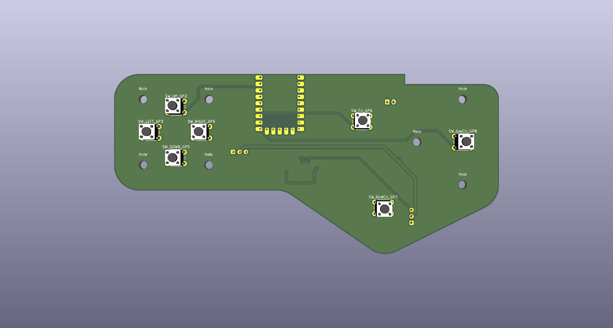
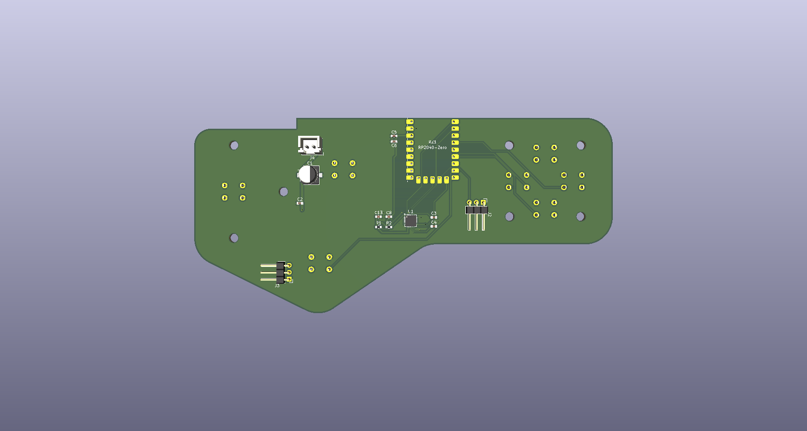
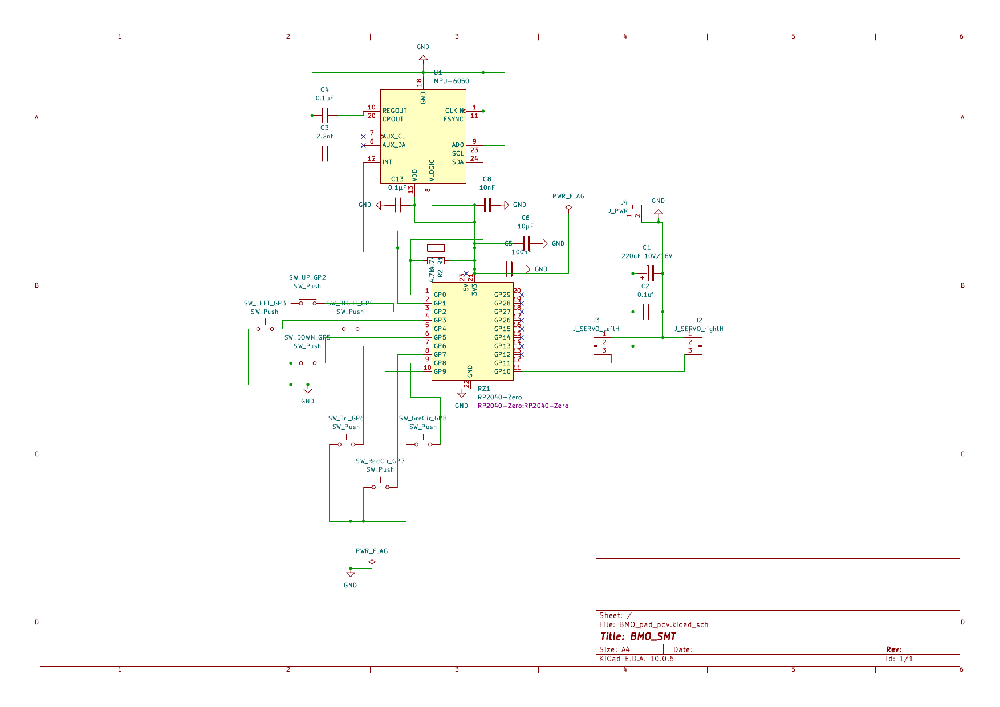

# BMO 맞춤형 PCB

[← 프로젝트 소개](../README_KR.md)

7인치 BMO의 전면 버튼, 자세 센서, 양팔 서보를 한 장에 연결하기 위해 **KiCad로 설계한 RP2040-Zero 기반 PCB**입니다. 회로도와 PCB 레이아웃을 완성하고 PCBWay에 제조 및 SMT 실장을 맡겼습니다. 현재는 실물 수령 전이며, 수령 후 관통홀 부품을 직접 납땜하고 기능을 검증할 예정입니다.

| 전면 3D 뷰 | 후면 3D 뷰 |
|:---:|:---:|
|  |  |

*KiCad에서 내보낸 PCB 설계 이미지입니다. 실물 기판 사진은 수령 후 추가합니다.*

## 목차

- [역할과 연결](#역할과-연결)
- [회로 구성과 핀 배치](#회로-구성과-핀-배치)
- [제조 및 실장](#제조-및-실장)
- [설계 및 제조 파일](#설계-및-제조-파일)
- [수령 후 조립과 검증](#수령-후-조립과-검증)

## 역할과 연결

| 구역 | 구성 | 역할 |
|---|---|---|
| 상위 제어 | Raspberry Pi 5 8GB | 화면과 상위 프로그램을 실행하고 RP2040-Zero와 USB로 연결할 계획 |
| 입력 | 방향 버튼 4개, 기능 버튼 3개 | BMO 전면의 물리 입력 |
| 자세 | MPU-6050 | 움직임 및 자세 데이터 읽기 |
| 구동 | 좌·우 서보 커넥터 | 양팔 서보의 제어 신호 연결 |
| 서보 전원 | 별도 2핀 전원 커넥터 | 서보 전원을 외부에서 공급하도록 설계 |

서보 전원은 RP2040-Zero의 전원 경로와 분리해 설계했습니다. 실제 전원 연결과 공통 접지, 서보 구동은 기판 수령 후 회로도를 기준으로 다시 확인합니다.

> **추가하면 좋은 사진:** PCB가 본체 전면에 들어가는 위치를 보여주는 Fusion 360 화면 또는 내부 장착 사진. 버튼과 화면의 상대 위치가 함께 보이면 좋습니다.

## 회로 구성과 핀 배치

아래 핀 이름은 보유 중인 KiCad PCB·부품 목록의 버튼 레퍼런스 및 연결 넷을 기준으로 정리했습니다. 펌웨어에 반영할 때는 최종 제조에 사용한 회로도와 대조해 주세요.

| RP2040-Zero 핀 | 연결 대상 |
|---|---|
| GP0 / GP1 | MPU-6050의 I²C 데이터(SDA) / 클록(SCL) |
| GP2 / GP3 / GP4 / GP5 | 위 / 왼쪽 / 오른쪽 / 아래 버튼 |
| GP6 / GP7 / GP8 | 삼각형 / 빨간 원 / 초록 원 버튼 |
| GP9 | MPU-6050 인터럽트(INT) |
| GP10 / GP11 | 오른팔 / 왼팔 서보 신호 |

### 회로도

이미지를 누르면 [원본 회로도 PDF](../hardware/pcb/BMO_pad_pcv_schematic.pdf)를 열어 확대해서 볼 수 있습니다. 회로를 수정하려면 아래의 KiCad 원본 파일을 사용하세요.

## 제조 및 실장

PCBWay의 협찬으로 PCB 제조와 SMD 부품 실장을 의뢰했습니다. 제조 및 SMT 공정은 업체가 진행하고 아래 관통홀 부품은 기판 수령 후 직접 납땜합니다.

| 구분 | 부품 | 수량 / 비고 |
|---|---|---|
| 업체 SMT | MPU-6050 `U1` | 1개 |
| 업체 SMT | 저항 `R1`, `R2` | 4.7 kΩ, 각 1개 |
| 업체 SMT | 커패시터 `C1`, `C2`, `C3`, `C4`, `C5`, `C6`, `C8`, `C13` | C1은 220 µF, 16 V, 6.3 × 5.4 mm SMD형으로 발주한 내용 확인 |
| 직접 납땜 | RP2040-Zero `RZ1` | 1개 |
| 직접 납땜 | 전면 푸시 버튼 | 7개 |
| 직접 납땜 | 오른팔·왼팔 서보 헤더 `J2`, `J3` | 각 1개 |
| 직접 납땜 | 서보 전원 커넥터 `J4` | 1개 |

부품 목록의 `DNP` 표시는 업체 SMT에서 제외하고 직접 장착할 부품을 뜻합니다. 실제 업체 생산 BOM·실장 좌표 파일과 KiCad 내보내기 파일이 같은 버전인지 최종 자료를 업로드할 때 확인하겠습니다.

> **추가하면 좋은 사진:** 도착 직후 기판 앞·뒷면 사진과 SMD 실장부 확대 사진. 직접 납땜한 뒤에는 같은 각도로 한 번 더 촬영해 실장 전후를 비교하면 좋습니다.

## 설계 및 제조 파일

제공받은 KiCad 프로젝트와 Gerber ZIP을 비교해 두 압축파일의 제조 데이터가 일치함을 확인했습니다. 작업 이력과 잠금 파일을 제외한 자료를 아래에서 내려받을 수 있습니다. 실제 PCBWay에 제출한 파일과의 최종 대조 및 실물 검증은 기판을 받은 뒤 진행합니다.

- **[KiCad 설계·BOM·실장 좌표·STEP 묶음 다운로드](../hardware/pcb/BMO_pad_pcv_source.zip)**
- **[제조용 Gerber·드릴 파일 다운로드](../hardware/pcb/BMO_PAD_GBR.Zip)**

| 파일 | 용도 |
|---|---|
| `BMO_pad_pcv.kicad_sch` | 편집 가능한 KiCad 회로도 |\n| [`BMO_pad_pcv_schematic.pdf`](../hardware/pcb/BMO_pad_pcv_schematic.pdf) | 전체 회로도 열람용 PDF |
| `BMO_pad_pcv.kicad_pcb` | 편집 가능한 KiCad PCB 레이아웃 |
| `BMO_pad_pcv.kicad_pro` | KiCad 프로젝트 설정 |
| `BMO_pad_pcv.csv` | 부품 목록(BOM) |
| `BMO_pad_pcv-all-poss.csv` | 부품 실장 위치·회전·면 정보 |
| `BMO_PAD_GBR.Zip` | 제조용 Gerber 10종, 드릴 파일 2종 등의 묶음 |
| `BMO_pad_pcv.step` | PCB 3D 형상 |

`*.kicad_prl`, `.history/`, `_restore_backup_*`, `*.lck`는 개인 작업 환경과 복구 이력이므로 배포용 묶음에서 제외했습니다. 재제조할 때는 **회로도·PCB·BOM·실장 좌표·Gerber가 같은 리비전**인지 확인해야 합니다.

> **추가하면 좋은 이미지:** KiCad PCB 3D 뷰 앞·뒷면, 회로도 PDF. 실물을 받아 기판 리비전 표기가 보이는 확대 사진도 곁들이면 파일과 기판을 대조하기 쉽습니다.

## 수령 후 조립과 검증

이 항목은 **수령 후 실행할 순서**입니다. 아래의 기능 테스트 결과는 아직 확인되지 않았습니다.

1. 실제 기판의 앞·뒷면, 부품 방향, 납땜 상태를 검사합니다.
2. 전원 단락 여부와 서보 전원 극성을 확인합니다.
3. RP2040-Zero, 버튼 7개, `J2`·`J3`·`J4`를 납땜합니다.
4. Raspberry Pi와 USB 연결을 확인하고 버튼별 입력을 시험합니다.
5. MPU-6050 통신과 센서값을 확인합니다.
6. 외부 서보 전원 연결 상태를 확인한 뒤 좌·우 서보를 각각 시험합니다.

시험 중 발견한 문제와 수정은 메인 문서의 [Troubleshooting & Design Changes](../README_KR.md#troubleshooting--design-changes)에 기록하겠습니다.

> **추가하면 좋은 사진·영상:** 납땜 완료된 기판, Pi와 PCB의 USB 연결 및 서보 전원 배선, 버튼 반응과 양팔 서보 동작을 보여주는 짧은 영상. 테스트 결과 표는 실제 측정한 뒤 채웁니다.
